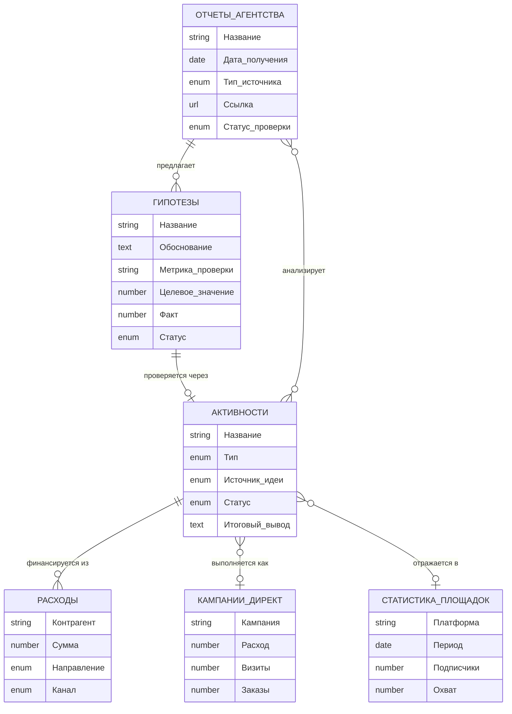

# Структура данных: история работы агентства и маркетинговых активностей

> Черновик архитектуры. **Не внедрено, ждёт решения владельца.** Визуальная версия (ER-диаграмма +
> карточки полей): https://claude.ai/code/artifact/e910f94d-584f-4bbf-b9a4-151c244b0833

---

## Проблема

Сейчас деньги (СП «Расходы»), метрики площадок (СП 1074) и по-кампанийная статистика (СП 1094)
существуют как три несвязанных потока. «Вселенная Потолкуем» — это просто 300 000 ₽ в расходах,
без связи с тем, откуда взялась идея (отчёт агентства), что мы хотели проверить (гипотеза) и как
она сработала. Три новые сущности связывают всё в одну прослеживаемую цепочку.

## Схема связей

Легенда: ОТЧЁТЫ АГЕНТСТВА, ГИПОТЕЗЫ, АКТИВНОСТИ — новые сущности. РАСХОДЫ (1070), КАМПАНИИ ДИРЕКТ
(1094), СТАТИСТИКА ПЛОЩАДОК (1074) — уже существуют в Б24, только получают необязательную связь.

---

## Три новые сущности

### Отчёты агентства — журнал входящих материалов

| Поле | Тип |
|---|---|
| Название | string |
| Дата получения | date |
| Тип источника | дашборд / таблица / doc / разовый отчёт |
| Ссылка | url |
| Ключевые заявления | text |
| Статус проверки | не проверено / частично / подтверждено / оспорено |
| Файл проверки | ссылка на `analytics/*.md` |

### Гипотезы — проверяемые предположения, наши и агентства

| Поле | Тип |
|---|---|
| Название | string |
| Обоснование | text |
| Метрика проверки | string |
| Целевое значение | number |
| Фактический результат | number |
| Статус | в процессе / подтверждена / опровергнута / неубедительно |
| Источник | наша / агентство |

Обязательное правило (проговорено отдельно): без метрики проверки и целевого значения, заданных
**заранее**, статус «подтверждена/опровергнута» превращается в мнение постфактум.

### Активности — связующий узел, «что мы вообще делаем»

| Поле | Тип |
|---|---|
| Название | string |
| Тип | контент / реклама / посевы / PR / клуб / прочее |
| Источник идеи | наша / агентство |
| Статус | план / активна / завершена / приостановлена |
| Цель | text |
| Ответственный | string |
| Итоговый вывод | text |

### Существующая сущность, получает связь

**Расходы (СП 1070)** — добавить необязательное поле-родитель «Активность». Остальные поля без
изменений (Контрагент, Сумма, Направление, Канал).

---

## Как это выглядит на реальном примере

Прослеживаем «Вселенную Потолкуем» от идеи до вывода — вместо разрозненной записи 300 000 ₽ без
контекста:

1. **Отчёт агентства** — «Платный трафик 2025–2026» (03.08.2026) формулирует гипотезу
   «Мультфильм и видео как вход в продукт».
2. **Гипотеза** — заводим отдельной записью: метрика проверки — переходы с видео на сайт,
   целевое значение задаём заранее, не постфактум.
3. **Активность** — «Вселенная Потолкуем» — анимационный пилот, источник идеи — агентство,
   ответственный — Мельников, статус — завершена.
4. **Расходы (1070)** — два платежа, аванс + окончательный, 300 000 ₽ — оба ссылаются на
   активность выше, а не висят сами по себе.
5. **Кампании Директ (1094)** — если под мультфильм запускалась отдельная кампания, она тоже
   привязывается, и отдача видна в одном месте с расходом.
6. **Вывод** — гипотеза закрывается фактическим результатом, не тонет в чате и не всплывает
   через полгода как забытый вопрос.

---

## Зачем это, а не проще

- **Деньги и смысл сейчас разъединены.** Расход и активность — то, что случилось, и то, зачем —
  сегодня существуют раздельно; чтобы понять «почему потратили», нужно вспоминать чат.
- **Отчёты агентства нечем удержать.** Сейчас — переписка и ссылки, которые забываются. Журнал
  со статусом проверки — единственный способ не сверять один и тот же отчёт дважды.
- **Гипотезы без цели необъективны.** Обсуждали отдельно: «подтверждена/опровергнута» без
  целевого значения, заданного заранее, — это просто мнение постфактум.

---

*Черновик 05.08.2026. Не внедрено — ждёт решения владельца по составу полей/сущностей перед
созданием смарт-процессов в Б24.*
