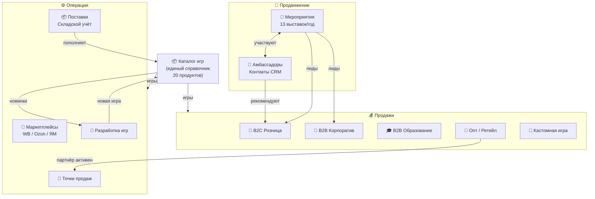
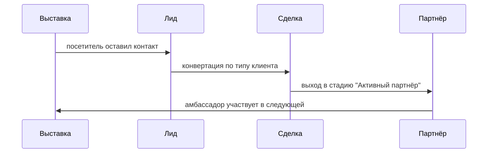

# Система управления «Потолкуем?»
### Построена на Битрикс24 · Версия 1.0 · Апрель 2026

---

## О системе

«Потолкуем?» — производитель настольных игр для развития речи. Серия включает 20+ игр: от универсальных до региональных и тематических выпусков. Продажи ведутся через маркетплейсы, офлайн-точки и прямые B2B-заказы.

**Цель системы:** единое пространство для управления всеми процессами компании — без Excel, без потерь информации, без лишней сложности.

---

## Архитектура системы



---

## Блоки системы

### 🎡 Мероприятия
**Что это:** реестр всех выставок, акций и открытых игр.

**Что фиксируется:**
- Тип (выставка / акция / открытая игра), место, даты
- Кол-во амбассадоров, проведённых сессий
- Трафик стенда, собранные контакты, продажи
- Бюджет план/факт, выручка, гонорары амбассадоров
- Оценка и разбор («что сработало / что улучшить»)

**Стадии:**
```
Идея/План → Подготовка → Готово к старту → Проведение → Закрытие → Архив
                                                                    └→ Отменено
```

**Форма:** амбассадор заполняет отчёт по ссылке → карточка создаётся автоматически.

---

### 🤝 Амбассадоры
**Что это:** расширенные контакты CRM с профилем амбассадора.

**Типы:** Амбассадор / Энтузиаст / Эксперт по речи и коммуникациям / HR-специалист / Журналист-блогер

**Ключевые поля:** специализация (темы игр), ставка за выход, % с продаж, статус активности, город.

**Связь с мероприятиями:** амбассадор прикрепляется к карточке выставки. История участий видна из карточки контакта.

---

### 💰 Воронки продаж
Пять независимых воронок под разные каналы:

| Воронка | Для кого | Типичная сделка |
|---------|---------|-----------------|
| **B2C Розница** | Частные покупатели | 1–3 игры, 6 800–21 600 ₽ |
| **B2B Корпоратив** | Компании, HR | 10–50 игр, командный тимбилдинг |
| **B2B Образование** | Школы, вузы, речевые эксперты | Наборы для кабинета |
| **Опт / Ретейл** | Магазины, кафе | Регулярные поставки |
| **Кастомная игра** | Бренды, организации | Уникальный продукт |

---

### 🛒 Маркетплейсы
**Принцип:** одна карточка = одна игра на одной платформе.

**Что отслеживается:** рейтинг, позиция в поиске, отзывы (в т.ч. без ответа), остаток, выручка/мес, активные акции.

**Платформы:** Wildberries, Ozon, Яндекс Маркет, Детский Мир, Flowwow.

---

### 📍 Точки продаж
Офлайн-партнёры: книжные магазины, кафе, коворкинги, музеи, школы.

**Что фиксируется:** условия (реализация/закупка/депозит), комиссия %, остаток на точке, план и факт продаж за месяц, даты последней поставки и визита.

---

### 📦 Поставки
**Принцип:** одна запись = один тираж одной игры.

**Стадии:**
```
Заказ размещён → В производстве → Готово к отгрузке → На складе → Распределено
                                                                  └→ Брак/Списано
```

**Что фиксируется:** производитель, тираж, себестоимость план/факт, даты, количество брака.

---

### 🔧 Разработка игр
**Стадии жизненного цикла новой игры:**
```
Идея → Контент → Дизайн → Прототип → Тестирование → Производство → Выпуск → Архив
```

**Что фиксируется:** концепция, эксперт по контенту, подрядчик, бюджеты по этапам, тираж, себестоимость, цена продажи.

---

### 📦 Каталог продуктов
Единый справочник всех игр. Является источником истины для всех остальных блоков.

**Серии:**
- 🟦 Универсальные (4 игры) — от 6 800 ₽
- 🟩 Тематические (8 игр) — от 7 200 ₽
- 🟨 Региональные (5 игр) — от 7 500 ₽
- 🔧 В разработке (3 проекта)

**Свойства каждой игры:** серия, статус, кол-во карточек, год выпуска, остаток на складе, минимальный остаток, в пути/производстве.

---

## Внешнее взаимодействие

### 🤝 Коллаб для амбассадоров
Защищённое рабочее пространство в Битрикс24 — без лицензии, бесплатно.

**Что видит амбассадор:**
- Задания на каждое мероприятие (чеклист + инструкция)
- Папку с материалами (скрипты, медиа, правила игры)
- Общий чат с командой
- Ссылку на форму отчёта

**Что не видит:** CRM, финансы, другие клиенты.

### 📋 Формы
Публичные формы по ссылке — без логина в Битрикс24:

| Форма | Кто использует | Что создаётся |
|-------|---------------|---------------|
| Отчёт амбассадора | Амбассадор после выставки | Карточка в «Мероприятиях» |
| Первый контакт | Посетитель стенда (с планшета) | Лид → B2C воронка |
| B2B-заявка | Корпоративный клиент | Лид → B2B воронка |
| Анкета партнёра | Новая точка продаж | Карточка в «Точках продаж» |

---

## Связи между блоками



---

## Планируемая автоматизация (следующий этап)

- При создании мероприятия → автоматически создаётся задача для амбассадора в коллабе
- При переходе сделки «Опт» в «Активный партнёр» → создаётся карточка «Точки продаж»
- При остатке < минимума → уведомление ответственному + задача на поставку
- Ежемесячный отчёт по маркетплейсам → автоматическая сводка директору

---

## Команда и доступы

| Роль | Что видит | Что делает |
|------|-----------|------------|
| Директор | Всё | Утверждает решения, смотрит дашборды |
| Менеджер продаж | CRM, сделки | Ведёт воронки, создаёт контакты |
| Маркетолог | Мероприятия, маркетплейсы | Готовит выставки, мониторит площадки |
| Производство | Каталог, поставки, разработка | Управляет тиражами |
| Амбассадор | Только свой коллаб | Выполняет задания, отчитывается |

---

*Система построена на Битрикс24 (тариф «Профессиональный»)*
*Документация: [github.com/sander23571-web/potolkuem-b24](https://github.com/sander23571-web/potolkuem-b24)*
